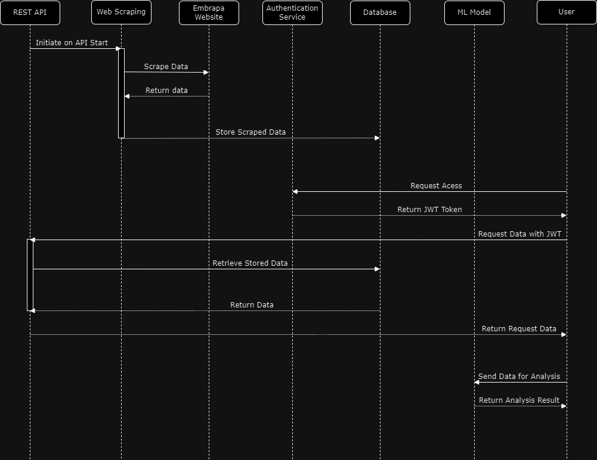

# 1MLET_FASE1_TECH_CHALLENGE

## Overview

This API is part of the Machine Learning Engineering FIAP Pos-Tech program. It provides a programmatic way to access data from the Embrapa website and allows users to retrieve relevant information through well-defined endpoints.

## Project Requirements

* #### Create a REST API in Python that queries the Embrapa website.
* #### The API must be documented.
* #### It is recommended (but not mandatory) to choose an authentication method (JWT, for example).
* #### Create a plan for deploying the API, designing the project architecture from ingestion to feeding the model (it is not necessary to develop an ML model here, but you need to choose an interesting scenario in which the API can be used).
* #### Make an MVP by deploying it with a shareable link and a GitHub repository.

## Solution Architecture Diagram


## Dependency and Control Flow Diagram


## Subsystem Sequence Diagram



## Prerequisites

- **Docker**
- **Docker Compose**

## Configuration

### Environment Variables

The application uses environment variables for configuration. Ensure the following variables are set:

You can set these variables in a .env file in the root directory:

```bash
MONGO_INITDB_ROOT_USERNAME=your_mongo_username
MONGO_INITDB_ROOT_PASSWORD=your_mongo_password
JWT_SECRET_KEY=your_jwt_secret_key
JWT_ALGORITHM=HS256
JWT_TOKEN_EXPIRE_MINUTES=15
```

## Usage Instructions

### Running with Docker

**Build and Start with Docker Compose**

```bash
docker-compose up --build -d
```

## Populating the Database

First you have to scrap the Embrapa website data by running the following command: 
```bash
python -m src.helpers.scrapper.async_web_scrapper
```

Alternatively you can uncomment the web-scrapping portion from `app.py`.

The database is populated automatically when the application starts for the first time.

## API Documentation

The API provides endpoints for accessing production, processing, trade, import, and export data from the Embrapa website.

### Endpoints

- `GET /docs` - Interactive Swagger documentation.

- `GET /auth/token` - Generate a JWT token for authentication.

- `GET /production/{year}` - Retrieve data on the production of wines, juices, and estimates in Rio Grande do Sul.

- `GET /processing/{year}` -Retrieve data on the quantity of grapes processed in Rio Grande do Sul.

- `GET /trading/{year}` - Retrieve data on the commercialization of wines and derivatives in Rio Grande do Sul.

- `GET /import/{year}` - Retrieve data on the import of grape derivatives.

- `GET /export/{year}` - Retrieve data on the export of grape derivatives.

### How to use: 

#### Generate the token:

```bash
curl -X GET \
  "http://localhost:8000/auth/token" \
  -H  "accept: application/json"
```
#### Use the generated token to fetch information from endpoints. Below is the example:

```bash
curl -X GET \
  "http://127.0.0.1:8000/production/2022" \
  -H "accept: application/json" \
  -H "Authorization: Bearer <your-token>"
```

Alternatively, the project has a collection of endpoint calls that can be called by Bruno and can also be used by the swagger documentation.

## Contributors (Group 43)
- Bruno Machado Corte Real 
- Pedro Henrique Romaoli Garcia
- Rodrigo Santili Sgarioni
- Daniela Schutt Bogorny

